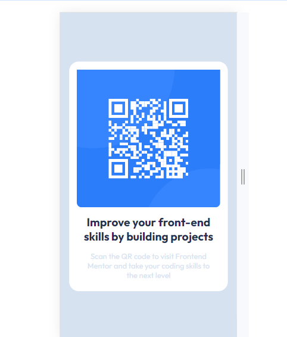
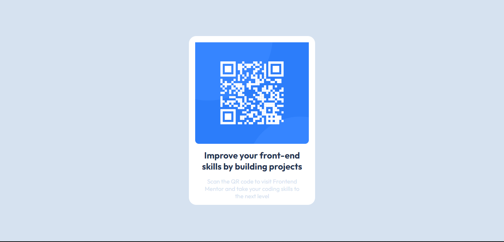

# Frontend Mentor - QR code component solution

This is a solution to the [QR code component challenge on Frontend Mentor](https://www.frontendmentor.io/challenges/qr-code-component-iux_sIO_H). Frontend Mentor challenges help you improve your coding skills by building realistic projects. 

## Table of contents

- [Overview](#overview)
  - [Screenshot](#screenshot)
  - [Links](#links)
- [My process](#my-process)
  - [Built with](#built-with)
  - [What I learned](#what-i-learned)
  - [Continued development](#continued-development)
  

**Note: Delete this note and update the table of contents based on what sections you keep.**

## Overview

A small webpage displaying a QR code.

### Screenshot
 

### Links

- Solution URL: [https://github.com/jaecoder20/QRcode-Component.git]
- Live Site URL: [https://jaecoder20.github.io/QRcode-Component/]

## My process
 - Working from outside in, bigger blue box, then smaller white box and finally QR image. Did mobile size first then proceeded to do Desktop.

### Built with

- CSS custom properties
- Mobile-first workflow

### What I learned

- Some concepts of mobile first development
- Media Queries

### Continued development

- For future projects I would like to focus on CSS Grid and Flexbox layouts. Those are a bit of a grey are for me so I would like to improve my skills on them.
- Reusable styles 
- Responsive design
